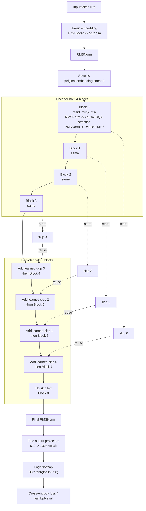

# Current Baseline Model Diagram

This diagram reflects the current default MLX baseline in `train_gpt_mlx.py`.

Run configuration used in the recent smoke test:
- `17,059,912` parameters
- `9` layers
- width `512`
- `8` attention heads
- `4` KV heads
- vocab size `1024`
- tied embeddings

Notes:
- Each block contains learned `resid_mix`, `attn_scale`, and `mlp_scale`.
- Attention uses separate Q/K/V projections, grouped-query attention, RMSNorm on Q and K, RoPE, and causal scaled dot-product attention.
- The MLP is `512 -> 1024 -> 512` with `ReLU^2`.
